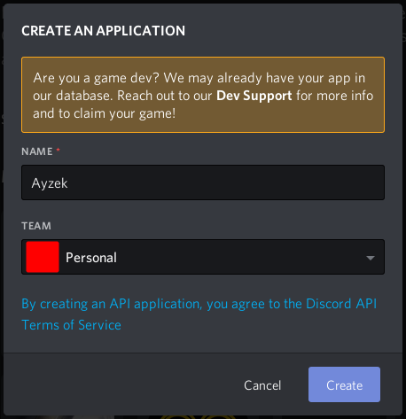
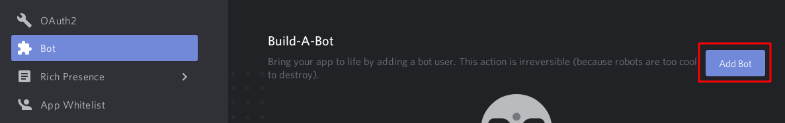
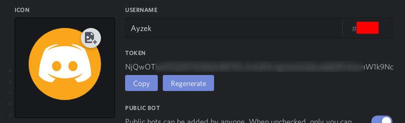
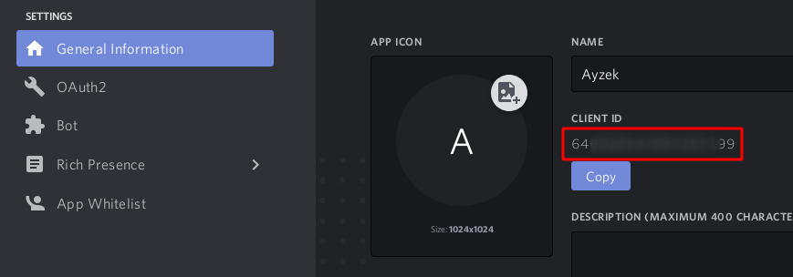
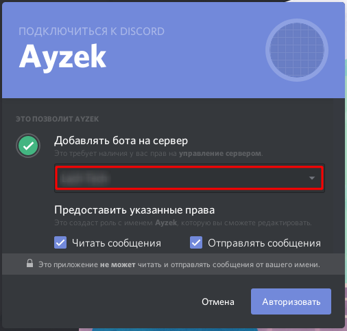

# DS Configuration

## Create application



## Create bot for your application



## Copy your bot token



## Add bot to guild

### Get your bot id



### Get invitation link

Copy&paste client id to this link (In place of `CLIENT_ID`):

```txt
https://discordapp.com/oauth2/authorize?client_id=CLIENT_ID&scope=bot&permissions=2329664
```

### Accept bot addition


